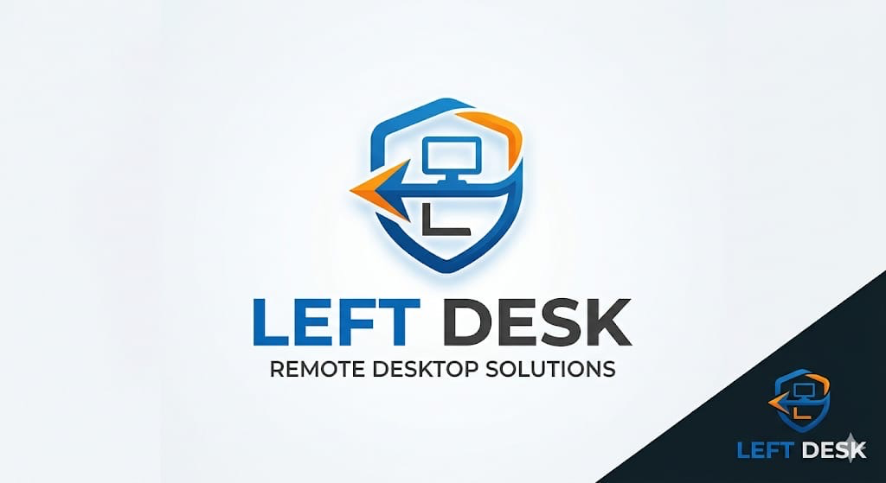

<div align="center">
  

  # LeftDesk
  ### Remote Desktop Solutions

  **Fast · Secure · Cross-Platform**

  [](https://github.com/krishnaashisharma/leftdesk/actions)
  [](LICENSE)

  [Download](#) · [Documentation](LEFTDESK_FORK_GUIDE.md) · [Self-Host Server](server/)
</div>

---

## ✨ Features

- 🔒 **End-to-end encrypted** remote desktop
- 🌐 **Works everywhere** — Windows, macOS, Linux, Android, iOS, Web
- ⚡ **P2P connection** with relay fallback — no latency compromise
- 📁 **File transfer** built in
- 🖥️ **Multi-monitor** support
- 🔧 **Self-hostable** — your data, your servers

## 📦 Download

| Platform | Download |
|----------|----------|
| Windows  | [LeftDesk-Setup.exe](#) |
| macOS    | [LeftDesk.dmg](#) |
| Linux    | [LeftDesk.AppImage](#) |
| Android  | [LeftDesk.apk](#) |

## 🚀 Quick Start

```bash
git clone https://github.com/krishnaashisharma/leftdesk
cd leftdesk
# See LEFTDESK_FORK_GUIDE.md for full build instructions
```

## 🖥️ Self-Host Your Server

```bash
cd server && ./setup.sh your-domain.com your@email.com
```

## 📖 Based On

LeftDesk is a white-label fork of [RustDesk](https://github.com/rustdesk/rustdesk), licensed under AGPL-3.0.

---

<div align="center">Made with ❤️ | © 2026 LeftDesk</div>
